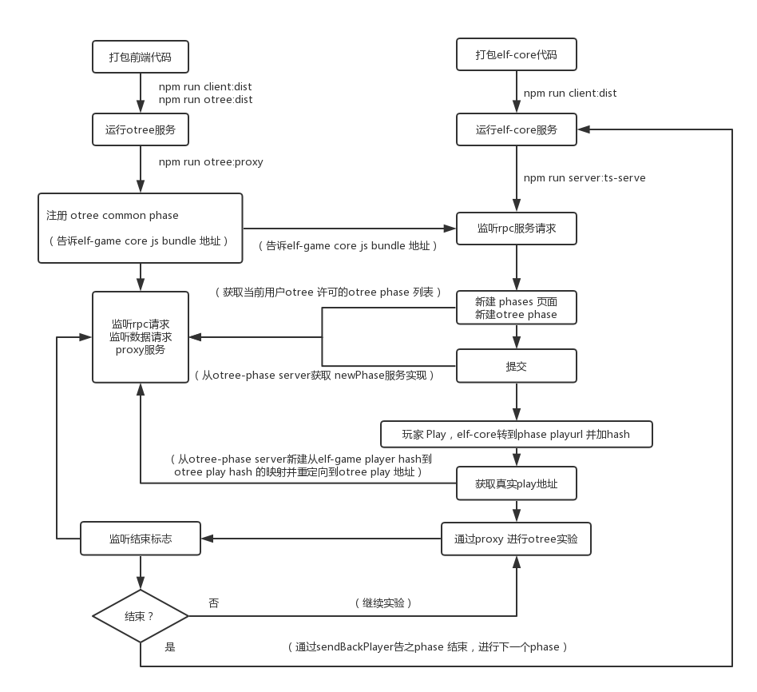

## 第三方服务接口连接 ELF

- oTree
- Quatrics
- 腾讯问卷
- 问卷星
- more

### Run

- Otree

```
npm run otree:dist # 创建组件打包
npm run otree      # 运行RPC、代理服务
```

- Qualtrics

```
npm run qualtrics:dist # 创建组件打包
npm run qualtrics      # 运行RPC、代理服务
```

- wjx

```
npm run wjx:dist # 创建组件打包
npm run wjx      # 运行RPC、代理服务
```

- qqwj

```
npm run qqwj:dist # 创建组件打包
npm run qqwj      # 运行RPC、代理服务
```

### 项目结构

#### 全局结构

```
v2.0-third-part-phase
│   nginx.conf  多服务器端口配置
│   tsconfig    全局文件路径配置   
│   
└───bin
│   └───script
│       │   
│       │   webpack  打包命令, core 与 phases

└───lib
    └───core
        └───client  前端core
        └───common  前端公用配置
        └───server
            └───config    settings 文件
            └───models    model 文件
    └───phases
        └───common      公用业务代码
        └───otree       第三方 oTree
            └───rpc       RPC
            └───server    代理服务
            └───view      创建视图
        └───quatrics    第三方 Qualtrics
            └───rpc       RPC
            └───server    代理服务
            └───view      创建视图
        └───wjx         第三方 问卷星
            └───rpc       RPC
            └───server    代理服务
            └───view      创建视图
        └───qqwj          第三方 腾讯问卷
            └───rpc       RPC
            └───server    代理服务
            └───view      创建视图
```

### Otree Phase 运行

```
1.npm run client:dist
2.npm run otree:proxy
```

#### oTree phase 服务流程图



#### Otree phase 服务流程

- otree common phase 打包，生成 otree namespace 下的 bundle，并生成 json 路径文件
- 启动 otree app (proxy,rpc,server) 时，向elf rpc 注册phase， 告之bundle路径和namesapce，且告之rpcuri，以供elf rpc获取 newPhase 服务的实现
- 当elf-game core 新建phase，获取到已注册phase 列表，从phase列表选择 otree
- otree common phase 组件加载到 elf-core，同时 fetch otree server（3070端口）的可使用otree phase列表
- otree server （3070） 返回给组件可用的（用户被允许新建的）otree phase 列表
- 点击列表中的某个 otree phase，即完成 phase新建
- 提交后，在初始化 group时，elf-game core 获取 elf-otree phase 的 newPhase服务
- 此时newPhase 服务完成 play路由、admin路由、elf-game player hash <=> otree-game player hash 映射的记录（数据库），同时保存phase 参数到数据库，此时 elf-game player hash 皆为空，等待玩家的到来
- 玩家获得play 地址，play地址后添加 elf-game 提供的hash，此时玩家访问 otree server（包含代理）
- 代理解析获得真实otree play路由，此时将数据库中 两个app hash映射关系保存，然后从定向到 otree play 路由
- 玩家进入 play 页面
- 监听结束标志，结束时，使用sendbackPlayer 告之 elf-game core 已完成phase
- elf-game core转向下一个phase
